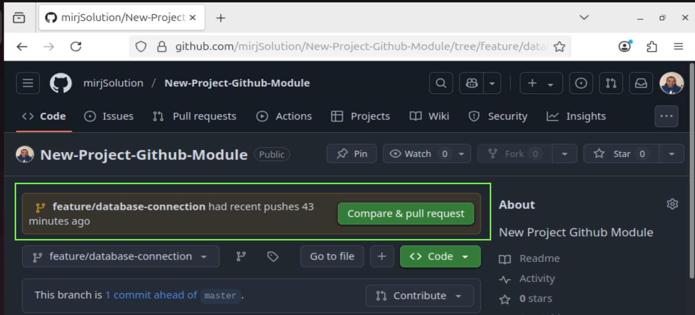
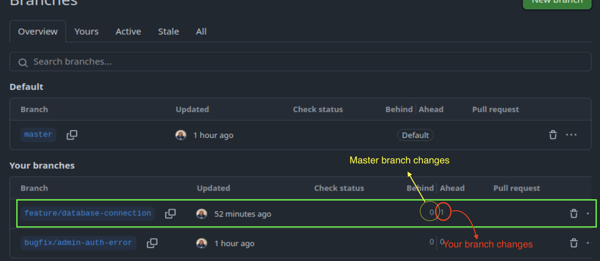

# 📥 Pull Request, Merge Requests and Code Review in Git Projects

> _"Keep `master` clean, tested, and production-ready."_

When working in a team, it’s a **best practice** not to merge directly to `master`. Instead, teams use **Pull Requests (PR)** or **Merge Requests (MR)** to manage and validate code changes. This ensures collaboration, quality, and stability before anything hits production.

## 👨‍💻 Why Use Pull Requests?

- ✅ Keep `master` branch clean and deployable at all times
- 🛠 Let developers review, validate, and collaborate on changes
- 📚 Encourage learning and code improvements
- 🧠 Catch bugs or messy implementations before they are merged
- 🚦 Offer a safety checkpoint before pushing to production

## 🔀 Review: What is a Branch?

A branch is an isolated environment for development. Instead of pushing directly to `master`, developers work on a separate branch like:

- `feature/admin-authentication`
- `bugfix/crash-on-startup`

These branches are based on `master` but evolve separately until the work is complete.

## 🚧 When is a Pull Request Created?

Once the feature or bugfix is ready, tested locally, and stable:

1. The developer **pushes** the branch to the remote Git server.
2. They **open a Pull Request (GitHub)** or **Merge Request (GitLab)** to propose merging into `master`.
3. A teammate (often a senior dev) is **assigned as a reviewer**.

Sample Pull Request image upon visiting your repository.



Sample Image of branches that is ahead of the master.



In this sample, I will update the README.md file and push it again to the repository. The video will that the feature/database-connection branch is ahead of the master branch by 2 commits


## 👁️ Review & Approval Workflow

1. 🔍 **Reviewer** checks the code, suggests improvements, or identifies issues.
2. 💬 They leave comments instead of rewriting the contributor’s code, encouraging learning.
3. ❌ If major issues are found, the PR/MR is rejected with feedback.
4. 🔁 The developer revises the branch and updates the PR/MR.
5. ✅ Once approved, the reviewer (or developer) **merges** the changes into `master`.

## 📊 GitLab vs GitHub Terminology

| Platform | Action Term        |
| -------- | ------------------ |
| GitLab   | Merge Request (MR) |
| GitHub   | Pull Request (PR)  |

## 🧪 Example Flow

```bash
# Create a new feature branch from master
git checkout master
git pull origin master
git checkout -b feature/database-connection

# Make and commit changes
git add .
git commit -m "Added DB connection logic"

# Push the branch
git push --set-upstream origin feature/database-connection
```

## 🧾 Review and Merge

1. Go to **GitLab or GitHub UI**
2. Create a **Merge Request** into `master`
3. Add reviewer and description
4. Reviewer approves and merges
5. Changes now part of `master` 🎉

## 📌 Best Practices

- 📂 Keep branches small and focused
- 💬 Communicate with your reviewers
- 🔁 Rebase or merge `master` frequently to reduce conflicts
- 🧹 Delete merged branches to keep the repo clean

## 📘 Summary

Pull Requests / Merge Requests promote:

- Clean, stable code
- Team collaboration and learning
- Production-readiness
- Reduced risk of introducing bugs

🧑‍💻 _Created by Rico John Dato-on_
🔗 [LinkedIn](https://www.linkedin.com/in/rico-john-dato-on) • [Portfolio](https://ricodatoon.netlify.app)
